# Market Agents

## Overview

This project provides agent framework for creating market agents with economic incentive. The agents have utilities for parallel AI inference and prompt caching using large language models (LLMs).

<p align="center">
  
</p>

## Function Calling Data Generation Pipeline

The `datagenie/marketagents_function_calling/` module provides a modular pipeline for generating function calling datasets. It supports two modes:
- **Curriculum Mode**: Generate tools and queries from task descriptions (CSV/JSONL)
- **HuggingFace Mode**: Augment existing datasets to multi-turn conversations

### Pipeline Architecture

```mermaid
flowchart TD
    subgraph Input["📥 Input"]
        A[Task Description / HF Dataset]
    end

    subgraph ToolGen["🔧 Tool Generation"]
        B[Tool Generator Agent]
        C[Docstring Agent<br/><i>conditional</i>]
    end

    subgraph QueryGen["💬 Query Generation"]
        D[Query Generator Agent]
    end

    subgraph ToolCalling["🔄 Tool Calling Workflow"]
        E[Initialize ChatThread<br/>with Tools & System Prompt]
        F[Send User Query]
        G{Response Type?}
        
        H[Tool Call]
        I[Schema Agent]
        J[Results Agent]
        K[Append Tool Results]
        
        L[Plain Text<br/><i>First Turn</i>]
        M[Clarification Agent]
        N[User Clarification]
        
        O[Plain Text<br/><i>After Tool Calls</i>]
        P[Summary Response]
    end

    subgraph FollowUp["🔁 Follow-up"]
        Q[Follow-up Agent]
        R[New User Query]
    end

    subgraph Output["📤 Output"]
        S[Results JSONL]
        T[ShareGPT JSONL]
        U[Agent Outputs JSONL]
    end

    A --> B
    B --> C
    C --> D
    B --> D
    D --> E
    E --> F
    F --> G
    
    G -->|Tool Call| H
    H --> I
    I --> J
    J --> K
    K -->|Loop Check| G
    
    G -->|Plain Text<br/>Turn 0| L
    L -->|Clarification<br/>Enabled| M
    M --> N
    N --> G
    L -->|Clarification<br/>Disabled| P
    
    G -->|Plain Text<br/>After Tools| O
    O --> P
    
    P --> Q
    Q --> R
    R --> E
    
    P --> S
    P --> T
    K --> U

    style ToolCalling fill:#e1f5fe
    style ToolGen fill:#fff3e0
    style QueryGen fill:#f3e5f5
    style FollowUp fill:#e8f5e9
```



### Workflow Details

1. **Tool Generation** (Curriculum mode only)
   - Generates realistic tool/function definitions from task descriptions
   - Optionally generates docstrings for tools lacking descriptions

2. **Query Generation** (Curriculum mode only)
   - Creates natural user queries that would invoke the generated tools
   - Includes all required parameters with realistic fake data

3. **Tool Calling Workflow**
   - Maintains a persistent `ChatThread` for conversation state
   - Handles multiple tool call rounds with loop detection
   - Supports clarification flow when assistant asks for more details

4. **Follow-up Generation**
   - Generates contextual follow-up queries based on conversation history
   - Runs another tool calling workflow for multi-turn samples

### Usage

```bash
# Curriculum mode (generate from task descriptions)
python -m datagenie.marketagents_function_calling.run --mode curriculum --limit 10

# HuggingFace mode (augment existing dataset)
python -m datagenie.marketagents_function_calling.run --mode huggingface --limit 100
```

### Configuration

See `datagenie/marketagents_function_calling/configs/` for:
- `pipeline_config.yaml` - Pipeline settings (mode, batch size, recursion depth)
- `agents_config.yaml` - Per-agent LLM configuration (model, temperature, max_tokens)

## Installation

To install the `market_agents` package in editable mode, follow these steps:

1. Clone the repository:

    ```sh
    git clone https://github.com/marketagents-ai/MarketAgents.git
    cd MarketAgents
    ```

2. Install the package in editable mode:

    ```sh
    pip install -e .
    ```

3. Install the required dependencies:

    ```sh
    pip install -r requirements.txt
    ```

4. Follow the README.md (just navigate to market_agents/agents/db)
    ```sh
    cat ./market_agents/agents/db/README.md
    ```

5. Make a copy of .env.example
    ```sh
    cp .env.example .env
    ```

    *Note: Setup API keys and more...*

7. Edit the ```market_agents/orchestrator_config.yaml``` accoding to your configuration

## Running Examples

You can run the `run_simulation.sh` as follows:

```sh
sh market_agents/run_simulation.sh
```

