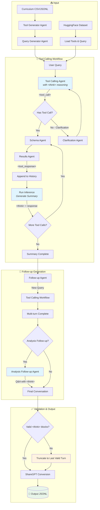

# MarketAgents Function Calling Dataset Generation Pipeline

A modular pipeline for generating multi-turn function calling datasets with chain-of-thought reasoning using the `minference` + `market_agents` SDK.

## Pipeline Workflow



## Features

- **Two generation modes**:
  - **Curriculum mode**: Generate tools and queries from task descriptions (CSV/JSONL)
  - **HuggingFace mode**: Augment existing single-turn datasets to multi-turn

- **Chain-of-thought reasoning** (`generate_reasoning=True`):
  - All assistant responses include `<think></think>` reasoning blocks
  - Uses `ResponseFormat.text` with XML tool call tags (Hermes format)
  - Validates `<think>` blocks on every assistant turn

- **Multi-agent architecture**:
  - Tool Generator Agent (curriculum mode)
  - Query Generator Agent (curriculum mode)
  - Docstring Generator Agent (conditional)
  - Schema Generator Agent
  - Results Generator Agent
  - Follow-up Query Agent
  - Clarification Agent (handles ambiguous queries)
  - Analysis Follow-up Agent (generates non-tool-calling follow-ups)

- **Robust validation**:
  - Validates `<think>` blocks on all assistant turns
  - Detects malformed `<tool_call>` tags (reasoning inside tool_call)
  - Detects truncated tool calls (max_tokens issues)
  - Removes consecutive user messages
  - Truncates to last valid turn (preserves data)

- **Parallel tool calls**: Supports multiple tool calls in a single turn

- **ShareGPT output format** with XML tags for tool calls/responses

## Installation

Ensure you have the required dependencies:

```bash
pip install minference market_agents pydantic datasets tqdm tenacity python-dotenv
```

## Usage

### Curriculum Mode

Generate from curriculum CSV/JSONL:

```bash
# Basic usage
python -m datagenie.marketagents_function_calling.run --mode curriculum --limit 10

# Filter by category
python -m datagenie.marketagents_function_calling.run --mode curriculum --categories "Use Apps" --limit 50

# Custom curriculum file
python -m datagenie.marketagents_function_calling.run --mode curriculum --curriculum my_tasks.jsonl --limit 100
```

### HuggingFace Mode

Augment existing datasets:

```bash
# Basic usage
python -m datagenie.marketagents_function_calling.run --mode huggingface --limit 100

# Custom dataset
python -m datagenie.marketagents_function_calling.run --mode huggingface --dataset Salesforce/xlam-function-calling-60k --start 0 --limit 100
```

## Configuration

### Pipeline Config (`configs/pipeline_config.yaml`)

```yaml
# Mode: "curriculum" or "huggingface"
mode: "huggingface"

# Generation settings
generation:
  batch_size: 8
  max_recursion_depth: 3
  generate_analysis_followup: true
  generate_reasoning: true        # Enable <think> blocks
  validate_reasoning: true        # Validate <think> format

# Validation settings
validation:
  validate_tool_calls: true
  allow_clarification_flow: true

# Output settings
output:
  dir: "outputs/function_calling"
  sharegpt: true
  debug_print_messages: true
```

### Agent Config (`configs/agents_config.yaml`)

Per-agent LLM configuration:

```yaml
tool_calling:
  model: "Hermes-4-405B"
  llm_client: "litellm"
  temperature: 0.6
  max_tokens: 8192

analysis_followup:
  model: "gpt-4o"
  llm_client: "openai"
  temperature: 0.6
  max_tokens: 2048
```

## Output Format

### ShareGPT Format with XML Tags

```json
{
  "id": "curriculum_0",
  "conversations": [
    {
      "from": "system",
      "value": "You are a deep thinking AI... <tools>[...]</tools>..."
    },
    {
      "from": "human", 
      "value": "Send a WhatsApp message to +1-555-123-4567"
    },
    {
      "from": "gpt",
      "value": "<think>\nOkay, the user wants to send a message...\n</think>\n\n<tool_call>\n{\"name\": \"send_whatsapp_message\", \"arguments\": {...}}\n</tool_call>"
    },
    {
      "from": "tool",
      "value": "<tool_response>\n{\"name\": \"send_whatsapp_message\", \"content\": {...}}\n</tool_response>"
    },
    {
      "from": "gpt",
      "value": "<think>\nThe message was sent successfully...\n</think>\n\nYour message has been sent!"
    },
    {
      "from": "human",
      "value": "What does the 'sent' status mean?"
    },
    {
      "from": "gpt", 
      "value": "<think>\nThe user is asking about message statuses...\n</think>\n\nThe 'sent' status means..."
    }
  ],
  "tools": "[...]",
  "task": "Send messages on Whatsapp",
  "category": "Use Apps",
  "subcategory": "Messaging apps",
  "source": "curriculum"
}
```

## Project Structure

```
datagenie/marketagents_function_calling/
├── __init__.py
├── config.py                    # PipelineConfig, AgentLLMConfig
├── schemas.py                   # Pydantic output schemas
├── pipeline.py                  # Main FunctionCallingPipeline class
├── run.py                       # CLI entry point
├── agents/
│   ├── __init__.py
│   ├── tool_generator.py        # Tool generation (curriculum)
│   ├── query_generator.py       # Query generation (curriculum)
│   ├── docstring_agent.py       # Docstring generation
│   ├── schema_agent.py          # Schema generation
│   ├── results_agent.py         # Results generation
│   ├── followup_agent.py        # Follow-up query generation
│   ├── clarification_agent.py   # Clarification handling
│   └── analysis_followup_agent.py  # Analysis follow-up Q&A
├── utils/
│   ├── __init__.py
│   ├── validation.py            # Tool call validation
│   ├── sharegpt.py              # ShareGPT format conversion
│   ├── reasoning.py             # <think> block validation
│   └── debug.py                 # Colored debug printing
└── configs/
    ├── pipeline_config.yaml
    ├── agents_config.yaml
    └── curriculum/
        └── function_calling.csv
```

## Processing Statistics

The pipeline tracks detailed statistics:

```
=== Processing Statistics ===
Total processed:     100
Successful:          95
Multi-turn samples:  80
Clarification flows: 5
Analysis follow-ups: 70
Reasoning generated: 285
Missing think blocks:3
Truncated convos:    2
Malformed tool calls:1
...
Success rate:        95.0%
```

## Key Behaviors

### Reasoning Mode (`generate_reasoning=True`)

- System prompt includes deep thinking instructions
- Tools embedded in system prompt as XML (`<tools>...</tools>`)
- All assistant turns MUST have `<think>` blocks
- Tool calls use `<tool_call>` XML tags (Hermes format)
- Missing `<think>` blocks cause task failure or truncation

### Truncation Logic

When final turns are invalid (missing `<think>` or malformed), the pipeline truncates to the last valid assistant turn instead of failing the entire task. This preserves valuable tool-calling data.

### Analysis Follow-up

After successful tool calling, generates a follow-up Q&A that:
- Asks a question answerable from existing tool results
- Requires reasoning over context (no new tool calls)
- Includes `<think>` block in the response

## Environment Variables

```bash
OPENAI_API_KEY=your_openai_key
ANTHROPIC_API_KEY=your_anthropic_key
LITELLM_API_KEY=your_litellm_key
LITELLM_ENDPOINT=http://localhost:8000/v1/chat/completions
```

## Reference

This pipeline replaces the legacy `datagenie/hermes_function_calling/datagen_salesforce.py` which used the old `src/` framework.
