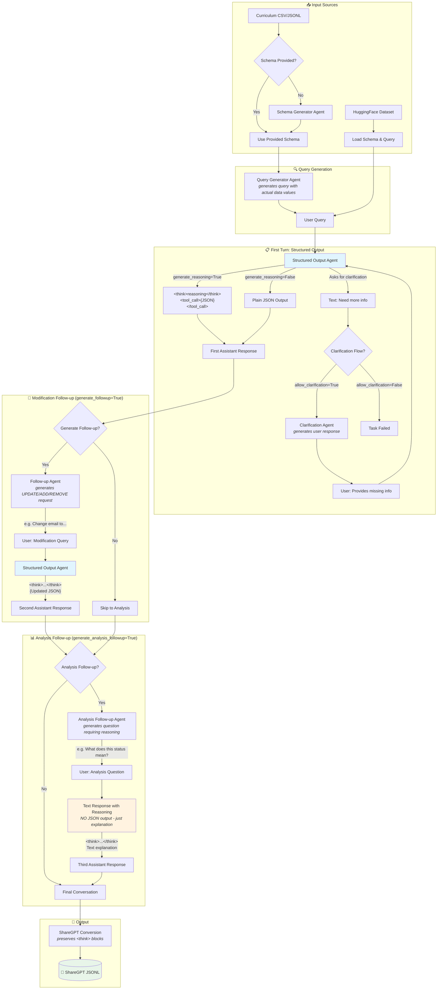

# MarketAgents Structured Output Dataset Generation Pipeline

A modular pipeline for generating structured output / JSON mode datasets with chain-of-thought reasoning using the `minference` + `market_agents` SDK.

## Pipeline Workflow



## Follow-up Types Explained

### 1. Modification Follow-up (`generate_followup=True`)
Generates a user request to **modify the structured output**:
- UPDATE: "Change the email to jane@company.com"
- ADD: "Add a phone number field"
- REMOVE: "Remove the middle name"

**Response**: New JSON with `<think>` reasoning + `<tool_call>` with updated data

### 2. Analysis Follow-up (`generate_analysis_followup=True`)
Generates a user question requiring **analysis/explanation** of the data:
- "What does this patent status mean?"
- "Can you explain the implications of this expression level?"
- "Was this sample from a human or animal model?"

**Response**: Text explanation with `<think>` reasoning (NO JSON output)

### 3. Clarification Flow (`allow_clarification_flow=True`)
When the model asks for clarification instead of generating JSON:
- Model: "Could you please provide the email address?"
- Clarification Agent generates: "The email should be john.doe@example.com"
- Model then generates the complete JSON

**Behavior**: Automatically retries with user-provided clarification (up to `max_clarification_turns`)

## Features

- **Two generation modes**:
  - **Curriculum mode**: Generate schemas and queries from task descriptions (CSV/JSONL)
  - **HuggingFace mode**: Augment existing single-turn datasets to multi-turn

- **Schema generation**: Automatically generate JSON schemas from task descriptions if not provided

- **Chain-of-thought reasoning** (`generate_reasoning=True`):
  - Assistant responses include `<think></think>` reasoning blocks
  - Validates `<think>` blocks when enabled

- **Multi-agent architecture**:
  - Schema Generator Agent (curriculum mode, when schema not provided)
  - Query Generator Agent
  - Structured Output Agent (uses `ResponseFormat.structured_output`)
  - Follow-up Query Agent (multi-turn)
  - Analysis Follow-up Agent (non-structured analysis Q&A)
  - Clarification Agent (handles clarification requests)

- **ShareGPT output format** with embedded JSON schema

## Installation

```bash
pip install minference market_agents pydantic datasets tqdm tenacity python-dotenv
```

## Usage

### Curriculum Mode

Generate from curriculum CSV/JSONL:

```bash
# Basic usage
python -m datagenie.marketagents_structured_output.run --mode curriculum --limit 10

# Filter by category
python -m datagenie.marketagents_structured_output.run --mode curriculum --categories "JSON Schema" --limit 50

# With reasoning
python -m datagenie.marketagents_structured_output.run --mode curriculum --generate-reasoning --limit 10

# Custom curriculum file
python -m datagenie.marketagents_structured_output.run --mode curriculum --curriculum path/to/tasks.csv --limit 100
```

### HuggingFace Mode

Augment existing datasets:

```bash
# Basic usage (requires dataset with schema field)
python -m datagenie.marketagents_structured_output.run --mode huggingface --dataset your/dataset --limit 100

# With multi-turn augmentation
python -m datagenie.marketagents_structured_output.run --mode huggingface --dataset your/dataset --max-turns 5 --limit 100
```

## Configuration

### Pipeline Config (`configs/pipeline_config.yaml`)

```yaml
mode: "curriculum"

generation:
  max_turns: 3
  generate_schema: true
  generate_followup: true
  generate_analysis_followup: false
  generate_reasoning: false
  allow_clarification_flow: true
  require_json_on_first_turn: false
  max_clarification_turns: 2

output:
  dir: "outputs/structured_output"
  sharegpt: true
  debug_print_messages: false
```

### Agent Config (`configs/agents_config.yaml`)

```yaml
schema_generator:
  client: "anthropic"
  model: "claude-3-5-sonnet-20241022"
  temperature: 0.3

structured_output:
  client: "litellm"
  model: "Hermes-4-405B"
  temperature: 0.4
  max_tokens: 8192
```

## Curriculum Format

### CSV Format

```csv
Category,SubCategory,Task,Schema
JSON Schema,Address Schema,"Create an address...","{\"type\":\"object\",...}"
JSON Generation,Character Profile,"Generate a character...",
```

The `Schema` column is optional - if empty, the pipeline will generate a schema from the task description.

### JSONL Format

```json
{"category": "JSON Schema", "subcategory": "Address", "task": "Create an address", "schema": {...}}
{"category": "JSON Generation", "subcategory": "Character", "task": "Generate a character"}
```

## Output Format

### ShareGPT Format

```json
{
  "conversations": [
    {"from": "system", "value": "You are a helpful assistant... <json_schema>...</json_schema>"},
    {"from": "human", "value": "Create a user profile for John Smith..."},
    {"from": "gpt", "value": "```json\n{\"name\": \"John Smith\", ...}\n```"},
    {"from": "human", "value": "Change the email to john@company.com"},
    {"from": "gpt", "value": "```json\n{\"name\": \"John Smith\", \"email\": \"john@company.com\", ...}\n```"}
  ],
  "json_schema": "{...}",
  "task": "Create a user profile",
  "category": "JSON Generation",
  "source": "curriculum"
}
```

## Project Structure

```
datagenie/marketagents_structured_output/
├── __init__.py
├── config.py                    # PipelineConfig, AgentLLMConfig
├── schemas.py                   # Pydantic output schemas
├── pipeline.py                  # Main StructuredOutputPipeline class
├── run.py                       # CLI entry point
├── agents/
│   ├── __init__.py
│   ├── schema_generator.py      # Schema generation (curriculum)
│   ├── query_generator.py       # Query generation
│   ├── followup_agent.py        # Follow-up query generation
│   ├── analysis_followup_agent.py  # Analysis follow-up Q&A
│   └── clarification_agent.py   # Clarification response generation
├── utils/
│   ├── __init__.py
│   ├── sharegpt.py              # ShareGPT format conversion
│   ├── reasoning.py             # <think> block validation
│   └── debug.py                 # Colored debug printing
└── configs/
    ├── pipeline_config.yaml
    └── agents_config.yaml
```

## Environment Variables

```bash
OPENAI_API_KEY=your_openai_key
ANTHROPIC_API_KEY=your_anthropic_key
LITELLM_API_KEY=your_litellm_key
LITELLM_ENDPOINT=http://localhost:8000/v1/chat/completions
```

## Key Differences from Function Calling Pipeline

| Feature | Function Calling | Structured Output |
|---------|-----------------|-------------------|
| Output Format | Tool calls + results | JSON conforming to schema |
| Response Format | `auto_tools` / `text` | `structured_output` |
| Schema Source | Tool definitions | JSON Schema |
| Multi-turn | Tool call chains | Schema modifications |
| Validation | Tool call validation | JSON Schema validation |
