# Pythonformer Dataset Generation Pipeline

A pipeline for generating interleaved reasoning + Python code training data using a REPL server. Designed for training models that solve problems through code execution with step-by-step reasoning.

## Supported Environments

Pythonformer supports multiple task types, each with specialized prompts and context management:

| Environment | Description | Context Format | Use Case |
|-------------|-------------|----------------|----------|
| **base** | General problem-solving | Single context or none | Math, algorithms, data analysis |
| **oolong** | Long-context analysis | Single large file (150K+ chars) | Document analysis, counting, aggregation |
| **hotpotqa** | Multi-hop reasoning | Multiple document files | Cross-document reasoning, fact verification |

### Environment Details

#### 1. Base Environment
- **Config**: `configs/default_config.yaml`
- **Context**: Optional, passed as variable or small file
- **Strategy**: Direct problem solving with code
- **Example**: Solve equations, implement algorithms, analyze data

#### 2. OOLONG Environment  
- **Config**: `configs/oolong_config.yaml`
- **Context**: Single `context.txt` file (150K+ characters)
- **Strategy**: Chunked processing + sub-agent for semantic analysis
- **Example**: Count occurrences in D&D transcripts, aggregate statistics

#### 3. HotpotQA Environment
- **Config**: `configs/hotpotqa_config.yaml`
- **Context**: Multiple files (`doc_01_Title.txt`, `doc_02_Title.txt`, ...)
- **Strategy**: Document discovery + multi-hop reasoning
- **Example**: "Which magazine was started first?", "What is the director's nationality?"

## Pipeline Workflow

```mermaid
flowchart TD
    subgraph Input["📥 Input"]
        A1[HuggingFace Dataset<br/><i>nvidia/Nemotron-Math-v2</i>] --> B1[Load Tasks<br/><i>streaming mode</i>]
        B1 --> C1[Task Queue]
    end

    subgraph REPLServer["🐳 REPL Server (Docker)"]
        D1[Flask REST API<br/><i>port 5003</i>]
        D2[PythonSandbox<br/><i>numpy, pandas, sympy, scipy</i>]
        D3[Session Manager<br/><i>isolated per task</i>]
        D1 --> D2
        D2 --> D3
    end

    subgraph Generation["🔄 Trajectory Generation Loop"]
        C1 --> E[Create REPL Session]
        E --> F[User Message<br/><i>problem prompt</i>]
        F --> G[LLM Generation<br/><i>Hermes-4-405B</i>]
        G --> H{Response Type?}
        
        H -->|"&lt;python&gt; block"| I[Execute Code<br/><i>via REPL server</i>]
        I --> J[Get Output + State]
        J --> K[Format Tool Response<br/><i>&lt;repl&gt; + &lt;state&gt;</i>]
        K --> L[Append to History]
        L --> G
        
        H -->|"&lt;final_answer&gt;"| M{Code Executed?}
        M -->|No| N[Nudge: Write Code First]
        N --> G
        M -->|Yes| O[Extract \\boxed Answer]
        
        H -->|No valid tags| P{Max Turns?}
        P -->|No| G
        P -->|Yes| Q[Mark Failed]
    end

    subgraph Validation["✅ Validation"]
        O --> R[Compare with Expected]
        R --> S{Answer Correct?}
        S -->|Yes| T[✅ Success + Correct]
        S -->|No| U[✅ Success + Incorrect]
        S -->|Unknown| V[✅ Success + Unvalidated]
        Q --> W[❌ Failed]
    end

    subgraph Output["📄 Output"]
        T --> X[ShareGPT JSONL]
        U --> X
        V --> X
        W --> Y[Skip/Log]
        X --> Z[("📊 Training Data<br/>with system prompt")]
    end

    style G fill:#e1f5fe
    style I fill:#fff3e0
    style O fill:#e8f5e9
    style N fill:#ffebee
    style Z fill:#e8f5e9
```



## Features

- **Code-first reasoning**: Model must execute Python code before providing final answers
- **Stateful REPL sessions**: Variables, functions, and imports persist across turns
- **State tracking**: `<state>` tags show imports, variables, functions, classes
- **Docker isolation**: REPL server runs in container with scientific packages
- **Parallel processing**: Batch processing with session isolation per task
- **Answer validation**: Extracts `\boxed{}` answers and compares with expected
- **Hallucination detection**: Strips model-generated `<repl>`/`<state>` tags
- **Streaming datasets**: Avoids downloading large HuggingFace datasets
- **Long-context support**: OOLONG environment with sub-agent for chunked semantic analysis
- **Sub-agent integration**: Hierarchical LLM calls for map-reduce style processing

## XML Format

```xml
<!-- Assistant writes code with reasoning as comments -->
<python>
# Let's solve this step by step
import sympy as sp

x = sp.Symbol('x')
result = sp.solve(x**2 - 4, x)
print(f"Solutions: {result}")
</python>

<!-- System executes and returns output + state -->
<repl>
Solutions: [-2, 2]
</repl>
<state>
imports: sympy | vars: x=Symbol('x'), result=[-2, 2]
</state>

<!-- After seeing results, assistant provides final answer -->
<final_answer>
The solutions are $x = \boxed{2}$ and $x = \boxed{-2}$.
</final_answer>
```

### Long-Context XML Format (OOLONG)

For long-context tasks, the pipeline uses additional tags for file input and sub-agent responses:

```xml
<!-- Long context provided as file reference -->
<file name="context.txt" type="txt" chars="152445">
[Content saved to workspace - use read_file('context.txt') to load]
</file>

<!-- Assistant uses sub-agent for semantic analysis of chunks -->
<python>
context = read_file('context.txt')
lines = context.split('\n')
chunk = '\n'.join(lines[0:200])

# Sub-agent counts rolls in this chunk
count = sub_agent(
    task=f"Count dice rolls in this D&D transcript. Return just the number.\n\n{chunk}",
    system_prompt="You count dice rolls. Return only an integer."
)
print(f"Rolls in chunk: {count}")
</python>

<!-- System returns REPL output + sub-agent response -->
<repl>
Rolls in chunk: 12
</repl>
<sub_agent task="Count dice rolls in this D&D transcript...">
12
</sub_agent>
<state>
imports: re, json | vars: context: str, lines: list[1653], chunk: str, count='12'
files: context.txt
</state>
```

## Installation

```bash
# Install dependencies
pip install datasets flask numpy pandas sympy scipy tqdm litellm

# Or with poetry
poetry install
```

## Quick Start

### 1. Start the REPL Server

```bash
# Option A: Docker (recommended)
cd datagenie/pythonformer/python_server
docker-compose up --build -d

# Option B: Direct (requires scientific packages installed)
python -m datagenie.pythonformer.python_server.server --port 5003
```

### 2. Run the Pipeline

```bash
# Base environment (math problems)
python -m datagenie.pythonformer.run \
    --config datagenie/pythonformer/configs/default_config.yaml \
    --limit 10

# OOLONG environment (long-context)
python -m datagenie.pythonformer.run \
    --config datagenie/pythonformer/configs/oolong_config.yaml \
    --limit 4 \
    --debug

# HotpotQA environment (multi-hop reasoning)
python -m datagenie.pythonformer.run \
    --config datagenie/pythonformer/configs/hotpotqa_config.yaml \
    --limit 4 \
    --debug
```

## Configuration

### Pipeline Config (`configs/default_config.yaml`)

```yaml
# LLM settings
main_model: "Hermes-4-405B"
main_client: "litellm"
main_temperature: 0.7
main_max_tokens: 4096

# REPL settings
repl:
  server_url: "http://localhost:5003"
  max_output_chars: 8192
  max_turns: 20
  timeout_seconds: 120

# Dataset settings
dataset:
  environment: "math-python"
  dataset_name: "nvidia/Nemotron-Math-v2"
  dataset_split: "medium"
  field_mapping:
    id: "uuid"
    prompt: "problem"
    expected_answer: "expected_answer"
  output_dir: "outputs/pythonformer"
  output_sharegpt: true
  batch_size: 4
```

### Long-Context Config (`configs/oolong_config.yaml`)

```yaml
# Main LLM (orchestrator)
main_model: "Hermes-4-405B"
main_client: "litellm"
main_temperature: 0.7
main_max_tokens: 4096

# Sub-LLM for sub_agent() calls (chunked analysis)
sub_model: "Hermes-4-70B"
sub_client: "litellm"
sub_temperature: 0.3
sub_max_tokens: 2048

# REPL settings
repl:
  server_url: "http://localhost:5003"
  max_output_chars: 8192
  max_turns: 10  # More turns for long-context exploration
  timeout_seconds: 180

# Dataset settings
dataset:
  environment: "oolong"
  dataset_name: "oolongbench/oolong-real"
  dataset_config: "dnd"
  dataset_split: "validation"
  field_mapping:
    id: "id"
    prompt: "question"
    expected_answer: "answer"
    context: "context_window_text"
  context_processor: "oolong"
  output_dir: "outputs/pythonformer_oolong"
  output_sharegpt: true
  batch_size: 4
```

## Output Format

### ShareGPT Format

```json
{
  "id": "task_uuid",
  "conversations": [
    {
      "from": "system",
      "value": "You are Pythonformer AI assistant..."
    },
    {
      "from": "human",
      "value": "Solve x^2 - 4 = 0"
    },
    {
      "from": "gpt",
      "value": "<python>\nimport sympy as sp\n..."
    },
    {
      "from": "tool",
      "value": "<repl>\nSolutions: [-2, 2]\n</repl>\n<state>\nimports: sympy | vars: ...\n</state>"
    },
    {
      "from": "gpt",
      "value": "<final_answer>\nThe solutions are $x = \\boxed{2}$ and $x = \\boxed{-2}$.\n</final_answer>"
    }
  ],
  "metadata": {
    "success": true,
    "final_answer": "...",
    "num_turns": 3,
    "num_code_blocks": 1
  }
}
```

## Project Structure

```
datagenie/pythonformer/
├── __init__.py
├── config.py                    # PythonformerConfig, EnvironmentType
├── pipeline.py                  # Main PythonformerPipeline class
├── repl_client.py               # HTTP client for REPL server
├── run.py                       # CLI entry point
├── prompts/                     # Task-specific system prompts
│   ├── __init__.py
│   ├── base.py                  # General problem-solving
│   ├── oolong.py                # Long-context analysis
│   ├── hotpotqa.py              # Multi-hop reasoning
│   └── README.md
├── reward_functions/            # Pluggable reward system
│   ├── __init__.py
│   ├── functions.py             # Reward function definitions
│   ├── compute_rewards.py       # Standalone reward computation
│   ├── README.md
│   └── IMPLEMENTATION.md
├── python_server/               # REPL server (Docker)
│   ├── __init__.py
│   ├── sandbox.py               # PythonSandbox with state tracking
│   ├── server.py                # Flask REST API + sub_agent endpoint
│   ├── Dockerfile
│   ├── docker-compose.yml
│   └── start_server.sh
├── utils/
│   ├── __init__.py
│   └── debug.py                 # Colored pretty printing
└── configs/
    ├── default_config.yaml      # Base environment
    ├── oolong_config.yaml       # OOLONG environment
    └── hotpotqa_config.yaml     # HotpotQA environment
```

## REPL Server API

| Endpoint | Method | Description |
|----------|--------|-------------|
| `/session/create` | POST | Create new sandbox session |
| `/session/{id}/execute` | POST | Execute code in session |
| `/session/{id}/state` | GET | Get session state |
| `/session/{id}/reset` | POST | Reset session |
| `/session/{id}` | DELETE | Delete session |
| `/sub_agent` | POST | Invoke sub-agent for semantic analysis |
| `/execute` | POST | Stateless single execution |
| `/health` | GET | Health check |

### Execute Response

```json
{
  "success": true,
  "output": "Solutions: [-2, 2]\n",
  "error": null,
  "truncated": false,
  "execution_time_ms": 45,
  "state": {
    "variables": {"x": {"type": "Symbol", "value": "x"}, "result": {"type": "list", "len": 2}},
    "functions": {},
    "classes": {},
    "modules": ["sympy"]
  },
  "state_formatted": "imports: sympy | vars: x=Symbol('x'), result: list[2]",
  "sub_agent_calls": []
}
```

### Sub-Agent Request/Response

```json
// Request
{
  "task": "Count dice rolls in this text. Return just the number.\n\nTravis: I roll a 15...",
  "system_prompt": "You count dice rolls. Return only an integer.",
  "model": "Hermes-4-70B",
  "client": "litellm",
  "max_tokens": 2048,
  "temperature": 0.3
}

// Response
{
  "response": "3",
  "model": "Hermes-4-70B",
  "client": "litellm"
}
```

## Processing Statistics

```
=== Pipeline Statistics ===
Total processed:    100
Successful:         92
Failed:             8
Success rate:       92.0%
Avg turns:          3.2
Avg code blocks:    2.1

=== Answer Validation ===
Correct:            78
Incorrect:          10
Unknown:            4
Accuracy:           88.6% (of 88 validated)
```

## Key Behaviors

### Code Execution Required

The model MUST execute at least one `<python>` block before providing `<final_answer>`. If it tries to answer without code:
1. The answer is ignored
2. A nudge message is injected: "You must execute Python code before providing a final answer"
3. Generation continues

### Session Isolation

Each task gets its own `REPLClient` instance with a unique session ID. This ensures parallel processing doesn't cause state pollution between tasks.

### State Tracking

After each code execution, the `<state>` tag shows:
- `imports:` - Imported modules (numpy, pandas, sympy, etc.)
- `functions:` - User-defined functions with signatures
- `classes:` - User-defined classes with methods
- `vars:` - Variables with types and values/shapes

### Answer Validation

Final answers should use `\boxed{}` format for validation:
```
<final_answer>
The answer is $\boxed{42}$.
</final_answer>
```

The pipeline extracts boxed values and compares with expected answers (case-insensitive, substring matching).

## Environment Variables

```bash
OPENAI_API_KEY=your_openai_key
LITELLM_API_KEY=your_litellm_key
LITELLM_ENDPOINT=http://localhost:8000/v1/chat/completions
```

## Debug Mode

With `--debug`, the pipeline shows colored output:
- 📤 **Green**: REPL output
- 📊 **Blue**: State information
- 🟣 **Magenta**: Code blocks
- ✅/❌ **Green/Red**: Final answer validation

```bash
python -m datagenie.pythonformer.run --config configs/default_config.yaml --limit 2 --debug
```

## Troubleshooting

### REPL Server Not Available

```
ERROR: REPL server not available!
Start it with: python -m datagenie.pythonformer.python_server.server --port 5003
```

Solution: Start the Docker container or run the server directly.

### Module Not Found in Sandbox

If sympy/numpy/etc. not found, the server is running outside Docker without packages installed. Use Docker or install packages in your environment.

### State Pollution Between Tasks

Fixed in latest version - each task now creates its own `REPLClient` instance for session isolation.

## Reward System

The pipeline includes a pluggable reward system for trajectory evaluation and filtering.

### Configuration

```yaml
dataset:
  enable_rewards: false  # Toggle: set to true to enable
  reward_function: "simple"  # Options: "simple", "efficiency", "normalized"
```

### Available Reward Functions

1. **simple**: Binary reward (+1 correct, -0.5 incorrect)
2. **efficiency**: Considers correctness, efficiency, and code quality
3. **normalized**: Normalized by trajectory length

### Standalone Reward Computation

Compute rewards on existing trajectories:

```bash
# Analyze rewards
python -m datagenie.pythonformer.reward_functions.compute_rewards \
    --input outputs/pythonformer_hotpotqa/traces_*.jsonl \
    --reward-function efficiency \
    --analyze-only

# Filter high-quality trajectories
python -m datagenie.pythonformer.reward_functions.compute_rewards \
    --input outputs/traces.jsonl \
    --reward-function simple \
    --min-reward 0.9 \
    --output outputs/high_quality.jsonl
```

See `reward_functions/README.md` for details on creating custom reward functions.

## RLM-Compatible Features

The sandbox now supports [Recursive Language Models (RLM)](https://arxiv.org/abs/2512.24601) paradigm features for RL training.

### Finalization Patterns

Multiple ways to signal task completion:

```python
# Pattern 1: Direct FINAL() call (recommended)
result = 42
FINAL(result)  # -> done=True, final_answer="42"

# Pattern 2: FINAL() via print (regex detected)
print(f'FINAL({result})')  # -> done=True, final_answer="42"

# Pattern 3: FINAL_VAR() for variable lookup
my_answer = "The count is 42"
FINAL_VAR("my_answer")  # -> done=True, final_answer="The count is 42"

# Pattern 4: Prime Intellect style answer dict
answer["content"] = "42"
answer["ready"] = True  # -> done=True, final_answer="42"
```

### Execution Result Fields

```python
@dataclass
class ExecutionResult:
    success: bool           # Code executed without error
    output: str             # stdout/stderr output
    error: Optional[str]    # Error message if failed
    truncated: bool         # Output was truncated
    execution_time_ms: int  # Execution time
    
    # State tracking
    answer: Dict[str, Any]  # answer variable state
    files_created: List[str]
    variables: Dict[str, str]
    state_formatted: str    # "imports: np | vars: x=42"
    sub_agent_calls: List[SubAgentCall]
    
    # RLM-style fields
    done: bool              # Episode complete
    final_answer: str       # Extracted final answer
    iteration: int          # Current iteration (1-indexed)
    reward: float           # Step reward for RL
```

### Reward Configuration

Configure rewards for RL training:

```python
from datagenie.pythonformer.repl_client import REPLClient

client = REPLClient()
client.create_session(
    max_iterations=30,
    reward_config={
        "on_success": 1.0,    # When FINAL() called
        "on_iteration": 0.0,  # Per step (can be negative)
        "on_error": -0.05,    # Code execution error
        "on_failure": -0.1,   # Max iterations reached
    }
)
```

### Episode State

Get full episode state for RL training:

```json
{
  "iteration": 5,
  "max_iterations": 30,
  "done": false,
  "final_answer": null,
  "context_length": 152445,
  "context_preview": "The following lines contains...",
  "available_variables": ["context", "lines", "count"]
}
```

### RL Training Integration

```python
from datagenie.pythonformer.repl_client import REPLClient

def collect_trajectory(client, context, task):
    """Collect a trajectory for RL training."""
    client.create_session(
        context=context,
        max_iterations=30,
        reward_config={"on_success": 1.0, "on_error": -0.05}
    )
    
    trajectory = []
    result = None
    
    while True:
        # Get code from policy
        code = policy.generate(result)
        
        # Execute and get reward
        result = client.execute(code)
        
        trajectory.append({
            "code": code,
            "output": result.output,
            "reward": result.reward,
            "done": result.done,
            "iteration": result.iteration,
        })
        
        if result.done:
            break
    
    return trajectory, result.final_answer
```

## Long-Context Pipeline (OOLONG)

The OOLONG environment is designed for long-context document analysis tasks where the context is too large to process in a single LLM pass.

### Architecture

```mermaid
flowchart TD
    subgraph Input["📥 Long Context Input"]
        A[OOLONG Dataset<br/><i>D&D transcripts ~150K chars</i>]
        A --> B[Save to Workspace<br/><i>context.txt</i>]
    end

    subgraph MainAgent["🤖 Main Agent (Hermes-4-405B)"]
        B --> C[Load & Explore Context]
        C --> D[Chunk Strategy]
        D --> E{Analysis Type?}
        
        E -->|Syntactic| F[Regex/Python<br/><i>pattern matching</i>]
        E -->|Semantic| G[Sub-Agent Calls<br/><i>map-reduce</i>]
    end

    subgraph SubAgent["🔧 Sub-Agent (Hermes-4-70B)"]
        G --> H[Process Chunk]
        H --> I[Return Result<br/><i>single number/value</i>]
        I --> J[Aggregate Results]
    end

    subgraph Output["📊 Final Answer"]
        F --> K[Combine Results]
        J --> K
        K --> L[\\boxed Answer]
    end

    style C fill:#e1f5fe
    style G fill:#fff3e0
    style H fill:#e8f5e9
    style L fill:#e8f5e9
```

### Sub-Agent Pattern

The main agent (405B) orchestrates while the sub-agent (70B) handles semantic analysis of chunks:

```python
# Main agent code - chunked map-reduce
context = read_file('context.txt')
lines = context.split('\n')
chunk_size = 200
results = []

for i in range(0, len(lines), chunk_size):
    chunk = '\n'.join(lines[i:i+chunk_size])
    
    # Sub-agent analyzes each chunk
    count = sub_agent(
        task=f"Count dice rolls in this chunk. Return just the number.\n\n{chunk}",
        system_prompt="You count dice rolls. Return only an integer."
    )
    results.append(int(count) if count.isdigit() else 0)
    print(f"Chunk {i//chunk_size}: {results[-1]} rolls")

total = sum(results)
print(f"Total rolls: {total}")
```

### Sub-Agent Function Signature

```python
sub_agent(
    task: str,                    # The question/task for the sub-agent
    system_prompt: str = None,    # Optional system prompt
    context: str = None           # Optional context (wrapped in <file> tags)
) -> str                          # Returns sub-agent response
```

### When to Use Sub-Agent

| Task Type | Use Sub-Agent? | Example |
|-----------|----------------|---------|
| Pattern counting | No - use regex | Count "rolls a \d+" patterns |
| Semantic counting | Yes | "How many times did Fjord attack?" |
| Classification | Yes | "Is this chunk about combat?" |
| Extraction | Yes | "What items were found in this scene?" |
| Aggregation | No - use Python | Sum chunk results |

### OOLONG Dataset

The pipeline supports the [OOLONG benchmark](https://huggingface.co/datasets/oolongbench/oolong-real) for long-context evaluation:

- **D&D transcripts**: ~150K character episode transcripts
- **Tasks**: Counting, aggregation, reasoning over long documents
- **Expected answers**: Ground truth for validation

### Example Output

```
============================================================
Task: 3952f2d5-082f-14b2-5ec4-d9cbedd2f865         
============================================================
Prompt: Total number of rolls in this episode?
Expected: 84
Saved context to context.txt (152,445 chars)

▶ Executing Code Block #1
<python>
context = read_file('context.txt')
lines = context.split('\n')
# ... chunked analysis with sub_agent() ...
</python>

<sub_agent> task: Count dice rolls in this chunk...
response: 12
<sub_agent> task: Count dice rolls in this chunk...
response: 8
...

<final_answer>
The total number of rolls in this episode is \boxed{84}.
</final_answer>

✅ Answer correct: 84 == 84
```

## Multi-Hop Reasoning Pipeline (HotpotQA)

The HotpotQA environment is designed for multi-hop reasoning tasks that require information from multiple documents.

### Architecture

```mermaid
flowchart TD
    subgraph Input["📥 Multi-Document Input"]
        A[HotpotQA Dataset<br/><i>10 documents per task</i>]
        A --> B[Create Separate Files<br/><i>doc_01_Title.txt, doc_02_Title.txt, ...</i>]
    end

    subgraph Discovery["🔍 Document Discovery"]
        B --> C[list_files<br/><i>doc_*.txt</i>]
        C --> D[search_files<br/><i>find relevant docs</i>]
        D --> E[Select Documents<br/><i>2-3 relevant from 10</i>]
    end

    subgraph Hop1["🎯 First Hop"]
        E --> F[Read Document 1]
        F --> G[Extract Entity/Fact<br/><i>via sub_agent</i>]
    end

    subgraph Hop2["🎯 Second Hop"]
        G --> H[Find Related Document]
        H --> I[Read Document 2]
        I --> J[Extract Answer<br/><i>via sub_agent</i>]
    end

    subgraph Output["📊 Final Answer"]
        J --> K[Compare/Combine]
        K --> L[\\boxed Answer]
    end

    style C fill:#e1f5fe
    style G fill:#fff3e0
    style J fill:#e8f5e9
    style L fill:#e8f5e9
```

### Multi-File Architecture

Each document is saved as a separate file for natural document hopping:

```
workspace/
├── doc_01_Arthurs_Magazine.txt
├── doc_02_First_for_Women.txt
├── doc_03_Radio_City.txt
├── doc_04_History_of_Albanian_football.txt
...
```

### Multi-Hop Example

```python
# Step 1: List available documents
docs = list_files("doc_*.txt")
print(f"Found {len(docs)} documents")

# Step 2: Find documents about both entities
laleli_files = [d for d in docs if 'Laleli_Mosque' in d]
esma_files = [d for d in docs if 'Esma_Sultan_Mansion' in d]

# Step 3: HOP 1 - Extract neighborhood from first document
laleli_text = read_file(laleli_files[0])
laleli_neighborhood = sub_agent(
    task=f"What neighborhood is the Laleli Mosque located in?\\n\\n{laleli_text}",
    system_prompt="Extract the neighborhood name. Return only the name."
)

# Step 4: HOP 2 - Extract neighborhood from second document
esma_text = read_file(esma_files[0])
esma_neighborhood = sub_agent(
    task=f"What neighborhood is the Esma Sultan Mansion located in?\\n\\n{esma_text}",
    system_prompt="Extract the neighborhood name. Return only the name."
)

# Step 5: Compare
if laleli_neighborhood.lower() == esma_neighborhood.lower():
    result = "Yes"
else:
    result = "No"
```

### HotpotQA Dataset

The pipeline supports the [HotpotQA dataset](https://huggingface.co/datasets/hotpotqa/hotpot_qa) for multi-hop reasoning:

- **Distractor config**: 10 documents (2 relevant + 8 distractors)
- **Fullwiki config**: Full Wikipedia retrieval (harder)
- **Question types**: Comparison, bridge (multi-hop)
- **Expected answers**: Short factual answers

### Example Output

```
============================================================
Task: 5adbf0a255429947ff17385a
============================================================
Prompt: Are the Laleli Mosque and Esma Sultan Mansion located in the same neighborhood?
Expected: no

▶ Executing Code Block #1
<python>
docs = list_files("doc_*.txt")
laleli_files = [d for d in docs if 'Laleli_Mosque' in d]
esma_files = [d for d in docs if 'Esma_Sultan_Mansion' in d]
# ... multi-hop extraction ...
</python>

<sub_agent> task: What neighborhood is the Laleli Mosque located in?
response: Laleli
<sub_agent> task: What neighborhood is the Esma Sultan Mansion located in?
response: Ortaköy

<final_answer>
No, the Laleli Mosque and Esma Sultan Mansion are not located in the same 
neighborhood. The Laleli Mosque is in the Laleli neighborhood, while the 
Esma Sultan Mansion is in the Ortaköy neighborhood.
</final_answer>

✅ Answer correct: No == no
```

### Comparison: OOLONG vs HotpotQA

| Aspect | OOLONG | HotpotQA |
|--------|--------|----------|
| Context Size | 150K+ chars | 5-10K chars |
| Files | 1 large file | 10 small files |
| Task Type | Counting/aggregation | Multi-hop reasoning |
| Strategy | Chunking + map-reduce | Document hopping |
| Sub-agent Use | Chunk analysis | Entity extraction |
| Complexity | Pattern matching | Cross-document reasoning |
