# Pythonformer Dataset Generation Pipeline

A pipeline for generating interleaved reasoning + Python code training data using a REPL server. Designed for training models that solve problems through code execution with step-by-step reasoning.

## Pipeline Workflow

```mermaid
flowchart TD
    subgraph Input["📥 Input"]
        A1[HuggingFace Dataset<br/><i>nvidia/Nemotron-Math-v2</i>] --> B1[Load Tasks<br/><i>streaming mode</i>]
        B1 --> C1[Task Queue]
    end

    subgraph REPLServer["🐳 REPL Server (Docker)"]
        D1[Flask REST API<br/><i>port 5003</i>]
        D2[PythonSandbox<br/><i>numpy, pandas, sympy, scipy</i>]
        D3[Session Manager<br/><i>isolated per task</i>]
        D1 --> D2
        D2 --> D3
    end

    subgraph Generation["🔄 Trajectory Generation Loop"]
        C1 --> E[Create REPL Session]
        E --> F[User Message<br/><i>problem prompt</i>]
        F --> G[LLM Generation<br/><i>Hermes-4-405B</i>]
        G --> H{Response Type?}
        
        H -->|"&lt;python&gt; block"| I[Execute Code<br/><i>via REPL server</i>]
        I --> J[Get Output + State]
        J --> K[Format Tool Response<br/><i>&lt;repl&gt; + &lt;state&gt;</i>]
        K --> L[Append to History]
        L --> G
        
        H -->|"&lt;final_answer&gt;"| M{Code Executed?}
        M -->|No| N[Nudge: Write Code First]
        N --> G
        M -->|Yes| O[Extract \\boxed Answer]
        
        H -->|No valid tags| P{Max Turns?}
        P -->|No| G
        P -->|Yes| Q[Mark Failed]
    end

    subgraph Validation["✅ Validation"]
        O --> R[Compare with Expected]
        R --> S{Answer Correct?}
        S -->|Yes| T[✅ Success + Correct]
        S -->|No| U[✅ Success + Incorrect]
        S -->|Unknown| V[✅ Success + Unvalidated]
        Q --> W[❌ Failed]
    end

    subgraph Output["📄 Output"]
        T --> X[ShareGPT JSONL]
        U --> X
        V --> X
        W --> Y[Skip/Log]
        X --> Z[("📊 Training Data<br/>with system prompt")]
    end

    style G fill:#e1f5fe
    style I fill:#fff3e0
    style O fill:#e8f5e9
    style N fill:#ffebee
    style Z fill:#e8f5e9
```



## Features

- **Code-first reasoning**: Model must execute Python code before providing final answers
- **Stateful REPL sessions**: Variables, functions, and imports persist across turns
- **State tracking**: `<state>` tags show imports, variables, functions, classes
- **Docker isolation**: REPL server runs in container with scientific packages
- **Parallel processing**: Batch processing with session isolation per task
- **Answer validation**: Extracts `\boxed{}` answers and compares with expected
- **Hallucination detection**: Strips model-generated `<repl>`/`<state>` tags
- **Streaming datasets**: Avoids downloading large HuggingFace datasets

## XML Format

```xml
<!-- Assistant writes code with reasoning as comments -->
<python>
# Let's solve this step by step
import sympy as sp

x = sp.Symbol('x')
result = sp.solve(x**2 - 4, x)
print(f"Solutions: {result}")
</python>

<!-- System executes and returns output + state -->
<repl>
Solutions: [-2, 2]
</repl>
<state>
imports: sympy | vars: x=Symbol('x'), result=[-2, 2]
</state>

<!-- After seeing results, assistant provides final answer -->
<final_answer>
The solutions are $x = \boxed{2}$ and $x = \boxed{-2}$.
</final_answer>
```

## Installation

```bash
# Install dependencies
pip install datasets flask numpy pandas sympy scipy tqdm litellm

# Or with poetry
poetry install
```

## Quick Start

### 1. Start the REPL Server

```bash
# Option A: Docker (recommended)
cd datagenie/pythonformer/python_server
docker-compose up --build -d

# Option B: Direct (requires scientific packages installed)
python -m datagenie.pythonformer.python_server.server --port 5003
```

### 2. Run the Pipeline

```bash
# Basic usage
python -m datagenie.pythonformer.run --config datagenie/pythonformer/configs/default_config.yaml --limit 10

# With debug output (colored pretty printing)
python -m datagenie.pythonformer.run --config datagenie/pythonformer/configs/default_config.yaml --limit 5 --debug
```

## Configuration

### Pipeline Config (`configs/default_config.yaml`)

```yaml
# LLM settings
main_model: "Hermes-4-405B"
main_client: "litellm"
main_temperature: 0.7
main_max_tokens: 4096

# REPL settings
repl:
  server_url: "http://localhost:5003"
  max_output_chars: 8192
  max_turns: 20
  timeout_seconds: 120

# Dataset settings
dataset:
  environment: "math-python"
  dataset_name: "nvidia/Nemotron-Math-v2"
  dataset_split: "medium"
  field_mapping:
    id: "uuid"
    prompt: "problem"
    expected_answer: "expected_answer"
  output_dir: "outputs/pythonformer"
  output_sharegpt: true
  batch_size: 4
```

## Output Format

### ShareGPT Format

```json
{
  "id": "task_uuid",
  "conversations": [
    {
      "from": "system",
      "value": "You are Pythonformer AI assistant..."
    },
    {
      "from": "human",
      "value": "Solve x^2 - 4 = 0"
    },
    {
      "from": "gpt",
      "value": "<python>\nimport sympy as sp\n..."
    },
    {
      "from": "tool",
      "value": "<repl>\nSolutions: [-2, 2]\n</repl>\n<state>\nimports: sympy | vars: ...\n</state>"
    },
    {
      "from": "gpt",
      "value": "<final_answer>\nThe solutions are $x = \\boxed{2}$ and $x = \\boxed{-2}$.\n</final_answer>"
    }
  ],
  "metadata": {
    "success": true,
    "final_answer": "...",
    "num_turns": 3,
    "num_code_blocks": 1
  }
}
```

## Project Structure

```
datagenie/pythonformer/
├── __init__.py
├── config.py                    # PythonformerConfig, EnvironmentType
├── pipeline.py                  # Main PythonformerPipeline class
├── repl_client.py               # HTTP client for REPL server
├── run.py                       # CLI entry point
├── python_server/               # REPL server (Docker)
│   ├── __init__.py
│   ├── sandbox.py               # PythonSandbox with state tracking
│   ├── server.py                # Flask REST API
│   ├── Dockerfile
│   ├── docker-compose.yml
│   └── start_server.sh
├── utils/
│   ├── __init__.py
│   └── debug.py                 # Colored pretty printing
└── configs/
    └── default_config.yaml
```

## REPL Server API

| Endpoint | Method | Description |
|----------|--------|-------------|
| `/session/create` | POST | Create new sandbox session |
| `/session/{id}/execute` | POST | Execute code in session |
| `/session/{id}/state` | GET | Get session state |
| `/session/{id}/reset` | POST | Reset session |
| `/session/{id}` | DELETE | Delete session |
| `/execute` | POST | Stateless single execution |
| `/health` | GET | Health check |

### Execute Response

```json
{
  "success": true,
  "output": "Solutions: [-2, 2]\n",
  "error": null,
  "truncated": false,
  "execution_time_ms": 45,
  "state": {
    "variables": {"x": {"type": "Symbol", "value": "x"}, "result": {"type": "list", "len": 2}},
    "functions": {},
    "classes": {},
    "modules": ["sympy"]
  },
  "state_formatted": "imports: sympy | vars: x=Symbol('x'), result: list[2]"
}
```

## Processing Statistics

```
=== Pipeline Statistics ===
Total processed:    100
Successful:         92
Failed:             8
Success rate:       92.0%
Avg turns:          3.2
Avg code blocks:    2.1

=== Answer Validation ===
Correct:            78
Incorrect:          10
Unknown:            4
Accuracy:           88.6% (of 88 validated)
```

## Key Behaviors

### Code Execution Required

The model MUST execute at least one `<python>` block before providing `<final_answer>`. If it tries to answer without code:
1. The answer is ignored
2. A nudge message is injected: "You must execute Python code before providing a final answer"
3. Generation continues

### Session Isolation

Each task gets its own `REPLClient` instance with a unique session ID. This ensures parallel processing doesn't cause state pollution between tasks.

### State Tracking

After each code execution, the `<state>` tag shows:
- `imports:` - Imported modules (numpy, pandas, sympy, etc.)
- `functions:` - User-defined functions with signatures
- `classes:` - User-defined classes with methods
- `vars:` - Variables with types and values/shapes

### Answer Validation

Final answers should use `\boxed{}` format for validation:
```
<final_answer>
The answer is $\boxed{42}$.
</final_answer>
```

The pipeline extracts boxed values and compares with expected answers (case-insensitive, substring matching).

## Environment Variables

```bash
OPENAI_API_KEY=your_openai_key
LITELLM_API_KEY=your_litellm_key
LITELLM_ENDPOINT=http://localhost:8000/v1/chat/completions
```

## Debug Mode

With `--debug`, the pipeline shows colored output:
- 📤 **Green**: REPL output
- 📊 **Blue**: State information
- 🟣 **Magenta**: Code blocks
- ✅/❌ **Green/Red**: Final answer validation

```bash
python -m datagenie.pythonformer.run --config configs/default_config.yaml --limit 2 --debug
```

## Troubleshooting

### REPL Server Not Available

```
ERROR: REPL server not available!
Start it with: python -m datagenie.pythonformer.python_server.server --port 5003
```

Solution: Start the Docker container or run the server directly.

### Module Not Found in Sandbox

If sympy/numpy/etc. not found, the server is running outside Docker without packages installed. Use Docker or install packages in your environment.

### State Pollution Between Tasks

Fixed in latest version - each task now creates its own `REPLClient` instance for session isolation.
