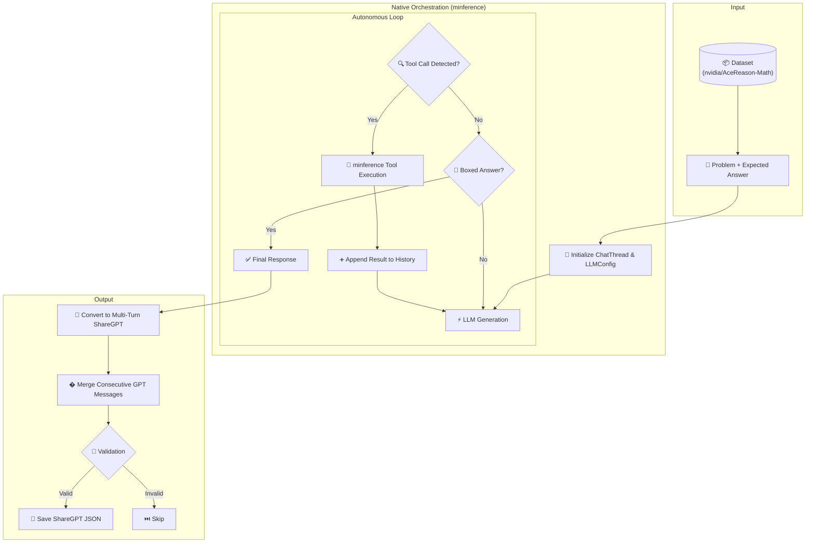

# Tool Use Data Generation

This directory contains pipelines for generating high-quality tool-use training data. It supports two primary methodologies: **Interleaved Tool Use** (client-side reasoning loops) and **Standard Tool Use** (scenario-based teacher forcing).

---

## 1. Standard Tool Use Data Generation (`datagen_tool_use.py`)

This pipeline uses **Teacher Forcing** to generate specific turns within a conversation based on high-quality human or synthetic seeds. It filters datasets into distinct scenarios to train specific model behaviors.

### Architecture: Teacher Forcing
Unlike the interleaved loop, this script does NOT execute tools live. Instead:
1.  **Context Loading**: It loads a conversation history from a dataset (e.g., `interstellarninja/hermes_reasoning_tool_use`).
2.  **Target Turn**: It identifies a specific turn (tool call or response) and prompts the model to generate it.
3.  **Validation**: The generated turn is validated against ground-truth JSON structures to ensure accuracy.

### Scenario Architecture
The suite classifies interactions into four primary categories, used by both the data generator and the multi-turn evaluation environment (`tool_use_multiturn_server.py`):

| Category | Characteristic | Interaction Pattern |
|----------|----------------|---------------------|
| **Single** | 1 Tool Call | `Human` → `Assistant (Call)` → `Tool` → `Assistant (Answer)` |
| **Multistep** | Sequential Calls | `Human` → `Assistant (Call 1)` → `Tool 1` → `Assistant (Call 2)` → ... → `Assistant (Answer)` |
| **Multiturn** | Interrupted Calls | `Human` → `Asst (Call)` → `Tool` → `Human (Feedback)` → `Asst (Call)` → ... |
| **Relevance** | No Tool Call | `Human` → `Assistant (Direct Answer)` |

#### Validation Criteria
- **Strict Parsing**: Every turn must include a `<think>` block.
- **Coherence**: Tools must only be used when relevant to the problem.
- **Context Awareness**: In `multiturn` scenarios, the model must respect historical context provided by the human between tool calls.

### Usage
```bash
python datagenie/tool_use/datagen_tool_use.py \
    --scenario multistep \
    --limit 100 \
    --batch_size 16
```

---

## 2. Interleaved Tool Use Data Generation (`datagen_tool_use_interleaved.py`)

This module generates training data where **tool calls are interleaved within reasoning**. Initially, thoughts are enclosed in `<think>` tags, and tool interactions use a multi-turn ShareGPT format. This implementation leverages **native tool-calling** via the `minference` library, ensuring robust execution while producing data compatible with interleaved reasoning models.

## Architecture Overview

**Native Interleaved Orchestration**

We use `minference.lite` to orchestrate the conversation. The model generates thoughts and tool calls natively; we then format these for the final training dataset:

1.  **Native Generation**: The model uses a standard tool-calling API. It emits reasoning in the content field and tool calls in the defined `tool_calls` structure.
2.  **Autonomous Loop**: `minference` handles the generation -> tool detection -> execution -> feedback loop automatically.
3.  **ShareGPT Conversion**: Post-generation, the structured `ChatMessage` history is converted into a multi-turn ShareGPT format:
    *   **GPT Turn**: Contains thoughts (`<think>`) and the tool call formatted as XML (`<tool_call>`).
    *   **Tool Turn**: Contains the JSON result of the tool execution.
    *   **Final GPT Turn**: Contains the concluding reasoning and the `\boxed{}` answer.



## Key Components

| Component | Description |
|-----------|-------------|
| `InterleavedToolUsePipeline` | Main orchestration class using `InferenceOrchestrator` |
| `_generate_with_tools()` | Orchestrates the multi-turn generation using `minference` |
| `_to_sharegpt_conversation()`| Converts structured history to multi-turn ShareGPT format |
| `_validate_interleaved_thinking()` | Validates answer correctness with unit/LaTeX normalization |

## Tool Selection & Usage

To ensure consistency, we restrict the model's tool availability to the `python_interpreter` for most mathematical tasks. This is achieved by:
1.  Providing a restricted tool list to the `ChatThread`.
2.  Using `ResponseFormat.auto_tools` to allow the model to choose between thinking and calling tools.

## Output Format (ShareGPT)

The final output follows a coherent multi-turn structure:

```json
{
  "conversations": [
    { "from": "human", "value": "..." },
    { 
      "from": "gpt", 
      "value": "<think>...\n<tool_call>\n{\"name\": \"python_interpreter\", \"arguments\": {\"code\": \"...\"}}\n</tool_call>" 
    },
    { "from": "tool", "value": "{...}" },
    { "from": "gpt", "value": "<think>...\n\nThe answer is \\boxed{...}" }
  ]
}
```

### 3. Setup Python Code Execution Server (`datagenie/code_execution_server`)

Interleaved tool use generation requires a running execution environment to process model-generated code dynamically.

#### Architecture
- **Server**: A lightweight Flask-based API (`server.py`) that accepts Python code and returns its output.
- **Environment**: Contained within a Docker image to ensure isolated execution and fixed dependencies (e.g., `build-essential`).
- **Safety**: The server implements a 5-second timeout to prevent infinite loops and executes code in a temporary `/tmp` workspace.

#### Running the Server
The server must be running on port `5002` before starting the data generation script.

1. **Build the Image**:
   ```bash
   cd datagenie/code_execution_server
   docker build -t cpp-flask-executor .
   ```

2. **Run the Container**:
   ```bash
   docker run -p 5002:5002 cpp-flask-executor
   ```

3. **Verify Connection**:
   You can test the server with a simple curl request:
   ```bash
   curl -X POST http://localhost:5002/execute \
     -H "Content-Type: application/json" \
     -d '{"code": "print(2 + 2)"}'
   ```

### 4. Running Data Generation

Once the server is running, execute the interleaved generation script:

```bash
python datagenie/tool_use/datagen_tool_use_interleaved.py \
    --limit 100 \
    --model Hermes-4-70B \
    --temperature 0.7
```

## Files

- `datagen_tool_use_interleaved.py` - Main pipeline script
- `test_interleaved_validation.py` - Unit tests for validation functions
